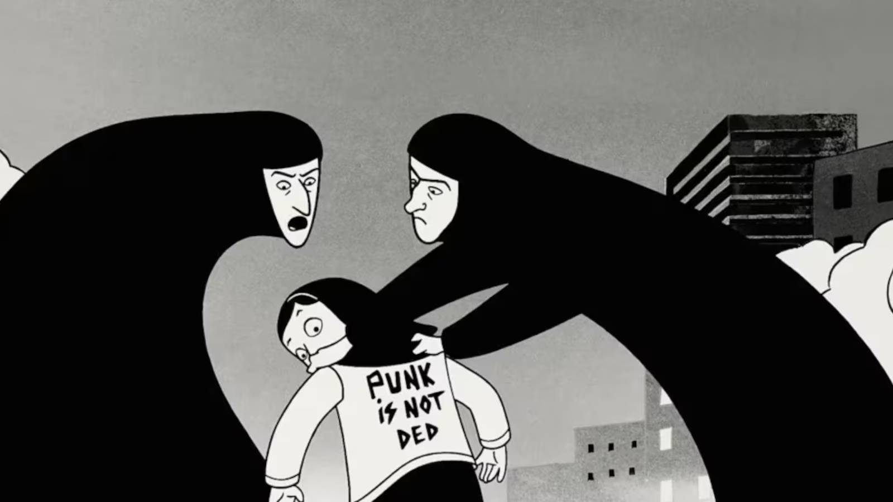

semana passada, ao ler as notícias do dia, me deparei com o seguinte título:

> Marjane Satrapi, autora de Persépolis, morre de tristeza aos 56 anos.

fiquei triste com a notícia. gosto muito do trabalho da marjane e é ruim pensar que não mais teremos obras delas. josé saramago é um de meus autores favoritos e, mesmo assim, preferi não ler tudo dele ainda, porque quando acabar, acabou. o pouco que falta tem seu lugar reservado para um momento que ainda não chegou.

o título da notícia também me deixou chocado: pessoas podem morrer de tristeza? fui pesquisar um pouco sobre isto. a síndrome do coração partido é uma doença que afeta o músculo cardíaco. acontece geralmente depois de um choque emocional muito forte (perda de alguém querido, um susto, uma notícia ruim) e os sintomas imitam um infarto: dor no peito, falta de ar, alterações no eletro. na maioria dos casos a pessoa se recupera, mas em casos raros pode ser fatal.

ainda pesquisando sobre o assunto, descobri que o risco de problemas no coração aumenta bastante logo nos primeiros dias após a perda de alguém querido, e que o luto costuma ser mais intenso justamente no primeiro ano. também vi que mulheres mais jovens são bem mais propensas a esse tipo de síndrome do que homens da mesma idade.

em comunicado enviado à AFP no dia 05 de junho, a família contou que marjane morreu de tristeza pouco mais de um ano depois da morte de mattias ripa, seu marido e o amor da vida dela. não sei se foi exatamente isso que aconteceu com ela, mas é fato que marjane se afundou numa profunda tristeza desde a morte de seu marido. 

persépolis é um quadrinho autobiográfico em que marjane conta a própria infância e adolescência durante a tomada do poder pelo regime islâmico no irã. ela tinha só dez anos quando precisou começar a usar o véu na escola, numa sala cheia de meninas. é a própria marjane, criança, que começa a nos contar a história, que embora trágica, está cheia de humor. um livro muito lindo, tanto pelos desenhos, quanto pelo texto da história. 

{fig-align="center"}

em 2007, um filme foi feito a partir do quadrinho, com direção da própria marjane. filme, como quadrinho, muito bonito.


